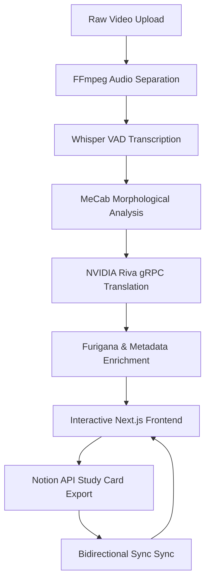

<div align="center">
  
  <h1>🇯🇵 JapanEase AI</h1>
  <p><strong>Transform any Japanese media into a personalized, interactive mastery experience.</strong></p>
  
  <div>
    
    
    
    
  </div>
</div>

---

## 📽️ Project Overview

**JapanEase AI** is a cutting-edge language learning platform that bridges the gap between passive media consumption and active linguistic acquisition. By combining advanced AI transcription, real-time morphological analysis, and seamless study-tool integration, JapanEase transforms raw video content into a comprehensive, interactive learning environment.

### 🌟 Key Enhancements
*   **NVIDIA Riva gRPC Pipeline**: Ultra-fast, high-fidelity Japanese-to-Hindi/English translation using NVIDIA's neural translation models.
*   **LLM Dictionary Enrichment**: Context-aware vocabulary definitions, JLPT levels, and AI-generated common usage examples.
*   **Bidirectional Notion Sync**: Real-time synchronization between your study cards and video player highlights. Deleting a card in Notion instantly updates your app.
*   **Interactive Subtitle Mastering**: Millisecond-accurate subtitle alignment with "Cascading Sync" for manual drift correction.

---

## ✨ Core Features

### 🧠 AI-Powered Insights
- **Dynamic Furigana Integration**: Automatic phonetic readings for all Kanji, adapting to the specific reading used in the audio.
- **Contextual Translation**: Sentence-level translations that understand the preceding conversation for maximum accuracy.
- **Deep Dictionary Popups**: Click any word to see its base form, reading, romaji, JLPT level, and AI-generated Hindi/English meanings.

### 🛠️ Study Accelerator
- **One-Click Notion Export**: Generate professional study cards in your Notion database with a single click.
- **Smart Highlighting**: Words saved to your library turn green across all your video projects for instant recognition of "known" vocabulary.
- **Sentence Looping**: Infinitely loop specific segments to master pronunciation and listening comprehension.

### 🎨 Premium User Experience
- **Draggable Dictionary**: A fluid, responsive dictionary popup that you can move anywhere within the player frame.
- **Precision Progress Bar**: Frame-accurate seeking and visual segment boundaries.
- **Auto-Sync Ecosystem**: Your library stays updated across sessions with automatic background synchronization.

---

## 🏗️ Technical Architecture



---

## 🚀 Getting Started

### Prerequisites
- **Python 3.10+** (Backend)
- **Node.js 18+** (Frontend)
- **NVIDIA Riva Server** (Optional, for gRPC translation)
- **Notion Integration Token**

### 1. Backend Setup
```bash
cd backend
python -m venv .venv
source .venv/bin/activate  # or .venv\Scripts\activate on Windows
pip install -r requirements.txt
# Configure your .env with NOTION_TOKEN, RIVA_API_KEY, etc.
python main.py
```

### 2. Frontend Setup
```bash
cd frontend
npm install
npm run dev
```

---

## 🛡️ License
Distributed under the MIT License. See `LICENSE` for more information.

---
<div align="center">
  <p>Built for the <b>NVIDIA & Google Deepmind Advanced Coding Agent Hackathon</b> by a dedicated team of Japanese learners.</p>
</div>
